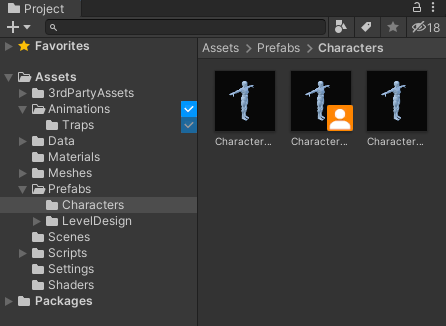

# Borrit

> Borrit is a tool for Unity adding a soft lock system for assets in the Editor

Working as a team on a Unity project can be troublesome because of potential difficult 
to resolve conflicts on some assets. This tool offers a simple way to borrow/return 
assets from the Project window directly.

It's currently independent from any version control system and can support different
databases to store the state of the borrowed assets.

## Installation
Use the package manager in Unity to install this package from its git url `https://github.com/rthery/borrit.git`  

It has been tested in Unity 2019.4 and 2020.3, it may work with earlier versions though.

### Google Sheets (Google Script Web App)
This is the preferred method to use Google Sheets as a database, as its project setup is much easier 
and it drastically reduces the setup time for other developers (to nothing if they are using git)

#### Project Setup
1. Go to Google Drive and create a Spreadsheet  
1. Create a Google App Script document, Tools > Script editor  
1. Paste the content of [GoogleAppScript.gs](Documentation/GoogleAppScripts/GoogleAppScript.gs)  
1. Save the script  
1. Press Deploy > New Deploy (top right corner of the page)  
1. Select type 'Web App' and select 'Anyone' for 'Who has access'  
1. Confirm deploy and copy the Web App URL displayed  
1. In Unity, Open Borrit settings, Edit > Project Settings > Borrit  
1. Select 'Google App Script' Database  
1. Paste the URL you just copied in the Script URL field  
1. Then push to git (or your VCS of choice) the files in `ProjectSettings\Packages\io.github.borrit`  

#### User Setup
Once the project is setup, you should not need to do anything if you are using git. Otherwise verify
the following:
1. Open Borrit settings, Edit > Project Settings > Borrit  
1. Select a username if it's empty  
1. Paste the appropriate Script URL if it's empty  
1. You are ready to use Borrit  

### Google Sheets (Google API)
This method can be interesting if you want all your users to be authenticated with their Google account.
It's very cumbersome to set up for all your devs though. 

You can find it in the package [borrit-gsheet](https://github.com/rthery/borrit-gsheet)

## Usage example

### Settings
In the Project Settings window, you can find a new entry "Borrit", where you are able to set
your username (make it unique within your team!) and select the database used to store the state 
of your assets.  
For the username, Borrit will by default use `git config user.name` if it's available

### Project
In the Project window, you can right click any asset or folder and select Borrit > Borrow.
This will mark the asset (or the folder and all its content) as borrowed by you. You can do the same
and select Return when you are done and the modified assets pushed to you remote repository.  
The state of assets if they are borrowed or not are pulled in the interval specified in the settings.
You also have the option to Refresh manually via that context menu.